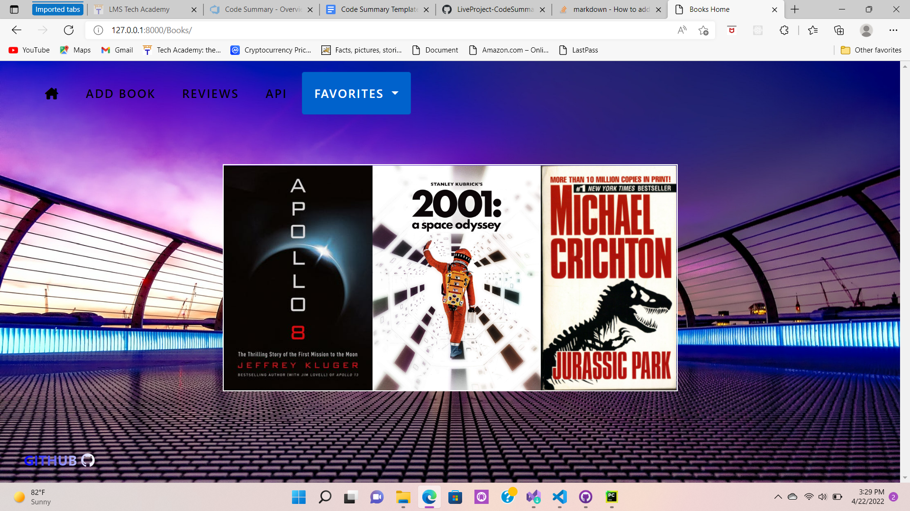
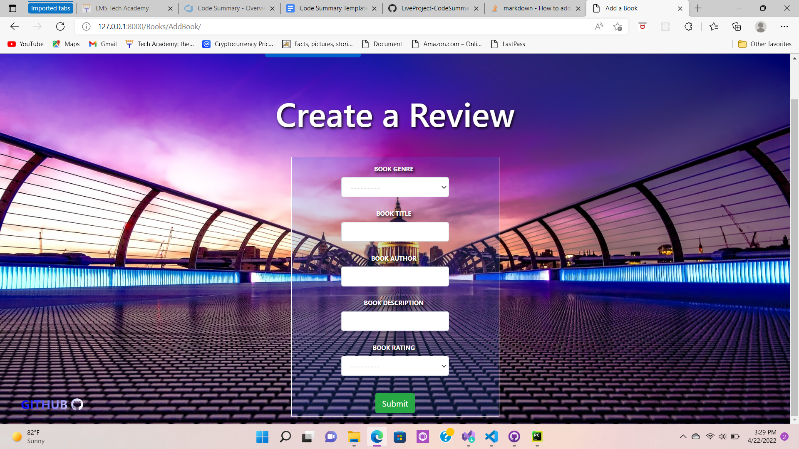
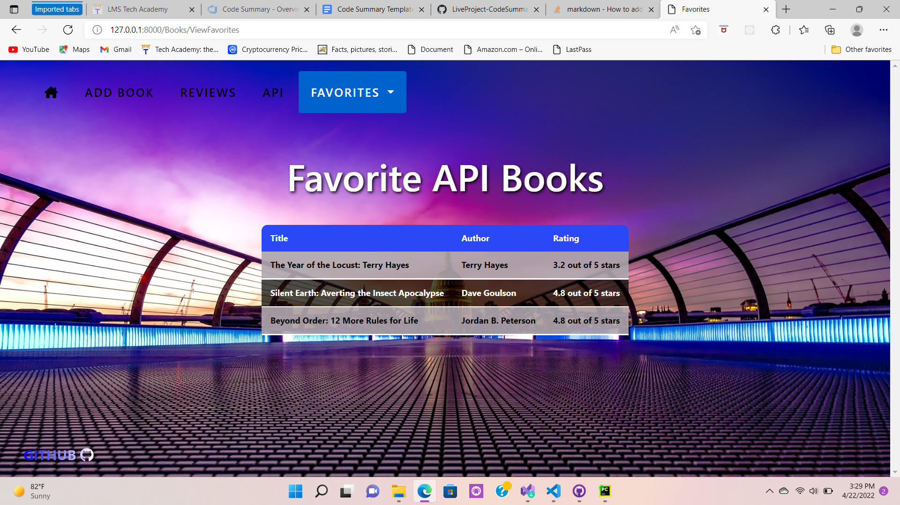

# LiveProject-CodeSummary
Code Summary of Python/Django Live-Project

## Introduction
I was part of a Live project for the last two weeks, where we used Python with the Django Framework to build websites. The cool thing about this project was we utilized
Agile methodologies and daily Scrums. I learned the logistics behind coding with other developers, utilizing version control by branching and making pull requests with master and most importantly, I learned front end and back end development and also with rendering API data to my templates.

## CRUD Functionality
Create, Read, Update & Delete; the basics of development. These were part of the beginning stories with our Project, and although seemingly simple, they do teach you the fundamentals of Software.

### Models(table)
    Here we created models in Django as an internal database table and also render a form on a template for a user to create an instance of that model!

    from django.db import models

    class AddBook(models.Model):
        book_genre = models.CharField(max_length=20, choices=BOOK_GENRE)
        book_title = models.CharField(max_length=100, null=False)
        book_author = models.CharField(max_length=100, null=False)
        book_description = models.CharField(max_length=100, null=False)
        book_rating = models.CharField(max_length=20, choices=BOOK_RATING)

    objects = models.Manager()

### Create logic

    def books_add_book(request):
        form = AddBookForm(data=request.POST or None)
        if request.method == 'POST':
            if form.is_valid():
                form.save()
                return redirect('books_reviews')
        content = {'form': form}
        return render(request, 'Books/Books_AddBook.html', content)

### Create template

    

    

    

     Add a Book

    
    <h1 class="fancy">Create a Review</h1>
    

        <form method="POST" class="add-book-form">
            
            {{ form|crispy }}
             
            <button class="btn btn-success" type="submit" name="Save_Review">Submit</button>
        </form>
    

    

### Read logic

    def books_reviews(request):
    book_entries = AddBook.objects.all()
    content = {'book_entries': book_entries}
    return render(request, 'Books/Books_Reviews.html', content)

### Read template

    <h1 class="fancy">User Reviews</h1>

    <table class="book-tables">
        <thead>
            <tr>
                <th>Author</th>
                <th>Title</th>
                <th>Details</th>
            </tr>
        </thead>
        <tbody>
            <tr>
            
                <td>{{ item.book_author }}</td>
                <td>{{ item.book_title }}</td>
                <td><a href=""><i class="fa-solid fa-angles-right"></i></a></td>
            </tr>
            
        </tbody>
    </table>

### Update 

    def books_update(request, pk):
    update_books = AddBook.objects.get(pk=pk)
    form = AddBookForm(request.POST or None, instance=update_books)
    if form.is_valid():
        form.save()
        return redirect('books_reviews')
    return render(request, 'Books/Books_Update.html',
                  {'update_books': update_books,
                   'form': form})

### Delete

    def books_delete(request, pk):
    delete_book = AddBook.objects.get(pk=pk)
    if request.method == 'POST':
        delete_book.delete()
        return redirect('books_reviews')
    return render(request, 'Books/Books_Delete.html')

## API
The final stories involved finding a relevant API to my App, rendering that JSON data into a template for our users. Once rendered, give the user an option to save that data into our local database and display it on another template. 

### API logic

    def books_api(request):
        title = []
        author = []
        rating = []
        description = []

        url = "https://bookshelves.p.rapidapi.com/books"

        headers = {
            "X-RapidAPI-Host": "bookshelves.p.rapidapi.com",
            "X-RapidAPI-Key": "1aed881129msh0e4e702933d3b57p1d0a71jsnaba2c0d6b2f8"
        }

        response = requests.request("GET", url, headers=headers)
        books_info = json.loads(response.text)
        for items in books_info['Books']:
            book_title = items['title']
            title.append(book_title)

            book_author = items['author']
            author.append(book_author)

            book_rating = items['review']
            rating.append(book_rating)

            book_description = items['description']
            description.append(book_description)

        zipped_list = zip(title, author, rating, description)

        context = {
                'zipped_list': zipped_list,
            }
        return render(request, 'Books/Books_API.html', context)

### API Render

    <table class="book-tables">
        <thead>
        <tr>
            <td>Title</td>
            <td>Author</td>
            <td>Rating</td>
            <td>Description</td>
        </tr>
        </thead>
        <tbody>
        
        <tr>
            <td>{{ title }}</td>
            <td>{{ author }}</td>
            <td>{{ rating }}</td>
            <td>{{ description }}</td>
        </tr>
        
        </tbody>
    </table>

### API save to database

    class FavoriteBook(models.Model):
        Title = models.CharField(max_length=100, null=False)
        Author = models.CharField(max_length=100, null=False)
        Rating = models.CharField(max_length=100, null=False)
        Source = models.CharField(max_length=100, null=False)

        Favorite_Book = models.Manager()

    def books_fav(request):
        book_titles = []
        url = "https://bookshelves.p.rapidapi.com/books"

        headers = {
            "X-RapidAPI-Host": "bookshelves.p.rapidapi.com",
            "X-RapidAPI-Key": "1aed881129msh0e4e702933d3b57p1d0a71jsnaba2c0d6b2f8"
        }

        response = requests.request("GET", url, headers=headers)
        books_info = json.loads(response.text)
        book_information = books_info['Books']
        for i in book_information:
            book_name = i['title']
            book_titles.append(book_name)
        if request.method == 'POST':
            value = request.POST['value']
            for fields in book_information:
                the_titles = fields['title']
                if value == the_titles:
                    new_books = FavoriteBook.Favorite_Book.create(Title=fields['title'],
                                                Author=fields['author'],
                                                Rating=fields['review'],
                                                )
                    new_books.save()
            return redirect('view_fav_books')
        else:
            return render(request, 'Books/Books_Fav.html', {'book_titles': book_titles})

### View new API selection from database

    def view_fav_books(request):
        added_favorites = FavoriteBook.Favorite_Book.all()
        context = {'added_favorites': added_favorites}
        return render(request, 'Books/Books_ViewFav.html', context)

### Render API db

    <table class="book-tables">
        <thead>
            <tr>
                <th>Title</th>
                <th>Author</th>
                <th>Rating</th>
            </tr>
        </thead>
        <tbody>
                
            <tr>
                <td>{{ books.Title }}</td>
                <td>{{ books.Author }}</td>
                <td>{{ books.Rating }}</td>
            </tr>
                
        </tbody>
    </table>

## Front End

